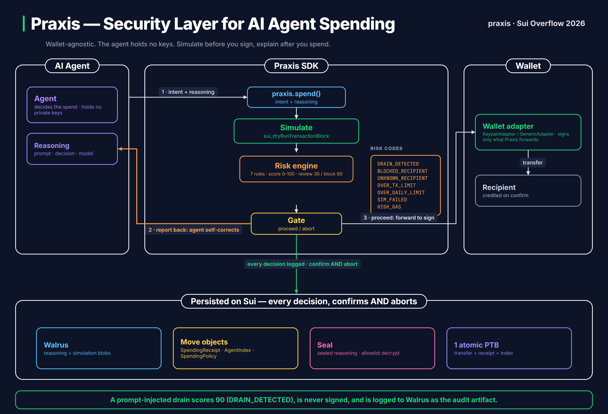

# Praxis

Wallet-agnostic security, simulation, and audit layer for AI agent spending on Sui.

Praxis sits between an AI agent and its wallet. The agent never holds a private
key. Before every spend, Praxis simulates the transaction, risk-scores the
result, and hands a report back to the agent to confirm or abort. Only then does
it ask the wallet to sign. Every decision, including aborts, is written to Walrus
with a tamper-evident on-chain receipt.

Built for Sui Overflow 2026 (Walrus track). Testnet, SUI-denominated spends in v1.

## The three-party model



The agent decides and holds no keys. Every spend enters the Praxis SDK as
`praxis.spend()`, is dry-run simulated, risk-scored against 7 rules, and gated.
Only on a proceed does the wallet adapter sign. Every decision, confirm and
abort, is persisted on Sui in one atomic PTB across Walrus, Move objects, and
Seal.

The novel part: the simulation and risk report flow back to the agent before
signing, so the agent can self-correct. A prompt-injected agent that tries to
drain the wallet gets stopped, and the blocked attempt is logged as the audit
artifact.

## What is in the box

```
move/praxis_core      Move package: spending_receipt, agent_registry, policy
packages/sdk          @allen-saji/praxis: the spend flow, risk engine, adapters,
                      Walrus + Seal integration, and a read-only PraxisReader
apps/agents           Sample agents: researcher, trader, attacker
apps/web              Next.js dashboard (read-only, decrypt-only)
scripts               Move deploy script
deployments           Recorded testnet package + object ids
```

## How a spend works

`Praxis.spend()` runs: build the transfer, dry-run it with
`sui_dryRunTransactionBlock`, score the result against the built-in rules, return
a report, gate on the recommendation, sign through the wallet adapter, write the
reasoning to Walrus, and emit an on-chain receipt in one programmable
transaction. Aborts skip the signing and transfer but still write the reasoning
and bump the on-chain abort counter.

Risk rules (v1): `DRAIN_DETECTED`, `BLOCKED_RECIPIENT`, `UNKNOWN_RECIPIENT`,
`OVER_TX_LIMIT`, `OVER_DAILY_LIMIT`, `SIM_FAILED`, `HIGH_GAS`. Scores 0 to 100;
review at 30, block at 80.

## SDK quickstart

```ts
import { Praxis, KeypairAdapter } from "@allen-saji/praxis";
import { Ed25519Keypair } from "@mysten/sui/keypairs/ed25519";
import { getJsonRpcFullnodeUrl, SuiJsonRpcClient } from "@mysten/sui/jsonRpc";

const client = new SuiJsonRpcClient({ url: getJsonRpcFullnodeUrl("testnet"), network: "testnet" });
const wallet = new KeypairAdapter(keypair, client);

const praxis = new Praxis({
  network: "testnet",
  wallet,
  policy: { maxPerTx: 50_000_000n, minRiskScoreToBlock: 80, requireSim: true },
});

const result = await praxis.spend({
  to: recipient,
  amount: 5_000_000n,
  reasoning: { prompt, decision, model: "claude-opus-4-8" },
  onReport: (report) => report.recommendation === "proceed",
});
// -> { status: "confirmed" | "aborted", receiptId?, walrusBlobId, txDigest?, simulationReport }
```

Read-only consumers (dashboards, auditors) use `PraxisReader`, which needs no
wallet:

```ts
import { PraxisReader } from "@allen-saji/praxis";

const reader = new PraxisReader({ network: "testnet" });
await reader.indexStats();          // { totalCount, totalAborts, abortRate }
await reader.stream(50);            // unified confirmed + aborted feed
await reader.reveal(blobId, viewer); // decrypt sealed reasoning if allowlisted
```

## Develop

```bash
pnpm install
pnpm move:test                       # Move unit tests
pnpm --filter @allen-saji/praxis build      # build the SDK
pnpm --filter @allen-saji/praxis-web dev        # run the dashboard

# Run the sample agents against testnet (operator key from your Sui keystore):
PRAXIS_OPERATOR_KEY=suiprivkey... pnpm --filter @allen-saji/praxis-agents start all
```

Deploy the Move package and record the ids:

```bash
pnpm deploy:move                     # publishes to the active Sui env
```

## Deployment (testnet)

Current ids live in `deployments/testnet.json` and `packages/sdk/src/config.ts`.

## Scope

v1 is testnet and SUI-only, ships `KeypairAdapter` and `GenericAdapter`, and uses
a local Seal stand-in for sealed reasoning (drop-in for real Seal key servers).
Post-hackathon: real wallet-provider adapters, multi-coin, mainnet, sponsored
transactions and zkLogin auth on the dashboard.

See `docs/SPEC.md` for the full product and technical spec.

## License

MIT
