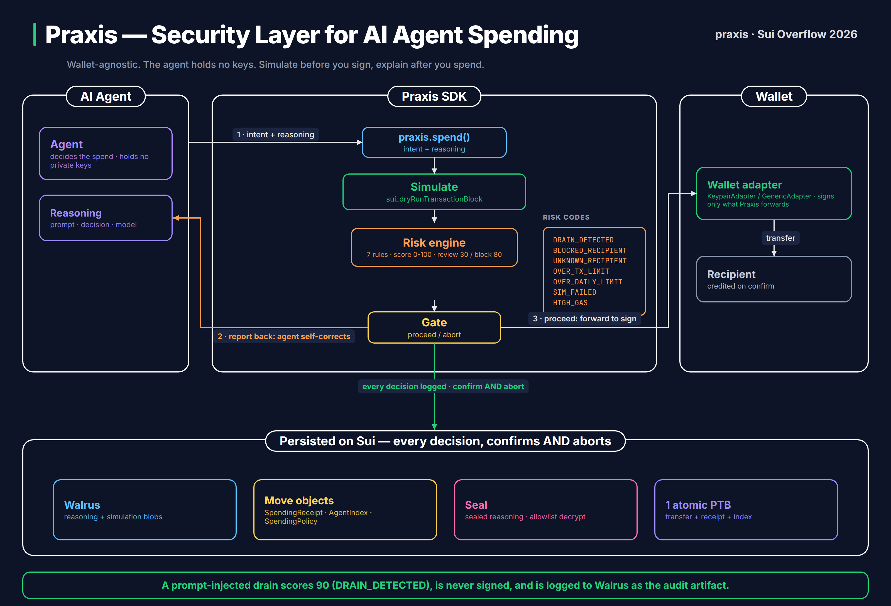

# Praxis

Wallet-agnostic security, simulation, and audit layer for AI agent spending on Sui.

Praxis sits between an AI agent and a Testnet execution wallet. Hosted agents
authenticate with scoped credentials and never receive the signing key. Every
intent is checked against versioned per-transaction, daily, and monthly policy,
reserved transactionally in PostgreSQL, simulated, and written to verified
Walrus evidence before an allowed transfer can be signed. Confirmed and blocked
outcomes are visible in the public audit dashboard and the owner workspace.

Built for Sui Overflow 2026 (Walrus track). Testnet, SUI-denominated spends in v1.

## The three-party model



The agent decides and holds no keys. In direct SDK mode, every spend enters as
`praxis.spend()`. In hosted mode, the agent submits an authenticated intent to
`POST /api/v1/spend-intents`. Praxis resolves the wallet and assignment policy,
reserves shared budget, dry-run simulates, publishes evidence, and only then
allows the configured wallet adapter to sign.

The novel part: the simulation and risk report flow back to the agent before
signing, so the agent can self-correct. A prompt-injected agent that tries to
drain the wallet gets stopped, and the blocked attempt is logged as the audit
artifact.

## What is in the box

```
move/praxis_core      Move package: spending_receipt, agent_registry, policy
packages/sdk          @allen-saji/praxis: transport-neutral Sui/Walrus services,
                      direct spend compatibility, and PraxisReader
packages/control-plane Pure policy, money, state-machine, and auth domain logic
packages/db           PostgreSQL schema, migrations, locks, repositories, audit
apps/agents           Sample agents: researcher, trader, attacker
apps/web              Public audit dashboard plus authenticated owner workspace
scripts               Reconciliation, deterministic seed, guarded live smoke
deployments           Recorded testnet package + object ids
```

## How a spend works

Hosted spend runs: authenticate credential, derive tenant/wallet/agent identity,
create or load an idempotent intent, resolve immutable policy versions, reserve
the UTC day/month allowance under PostgreSQL locks, simulate through Sui gRPC,
publish and verify public evidence through Walrus, sign, submit, wait, and settle
the reservation. Ambiguous submission retains its reservation and is reconciled
by stored transaction digest before any retry. A blocked spend never executes a
transfer; abort evidence and an on-chain abort record are tracked separately.

Risk rules (v1): `DRAIN_DETECTED`, `BLOCKED_RECIPIENT`, `UNKNOWN_RECIPIENT`,
`OVER_TX_LIMIT`, `OVER_DAILY_LIMIT`, `SIM_FAILED`, `HIGH_GAS`. Scores 0 to 100;
review at 30, block at 80.

## SDK quickstart

```ts
import { Praxis, KeypairAdapter, makeSuiClient } from "@allen-saji/praxis";
import { Ed25519Keypair } from "@mysten/sui/keypairs/ed25519";

const keypair = Ed25519Keypair.fromSecretKey(process.env.KEY!);
const client = makeSuiClient("testnet");
const wallet = new KeypairAdapter(keypair, client);

const praxis = new Praxis({
  network: "testnet",
  wallet,
  policy: { maxPerTx: 50_000_000n, minRiskScoreToBlock: 80, requireSim: true },
});

const result = await praxis.spend({
  to: recipient,
  amount: 5_000_000n,
  reasoning: { prompt, decision, model: "claude-opus-4-8" },
  onReport: (report) => report.recommendation === "proceed",
});
if (result.status === "confirmed") {
  console.log(result.txDigest, result.receiptId, result.walrusBlobId);
} else {
  console.log(result.abortReason, result.walrusBlobId, result.simulationReport);
}
```

Read-only consumers (dashboards, auditors) use `PraxisReader`, which needs no
wallet:

```ts
import { PraxisReader } from "@allen-saji/praxis";

const reader = new PraxisReader({ network: "testnet" });
await reader.indexStats();          // { totalCount, totalAborts, abortRate }
await reader.stream(50);            // unified confirmed + aborted feed
await reader.reveal(blobId, viewer); // decrypt sealed reasoning if allowlisted
```

## Develop

```bash
pnpm install
cp .env.example .env
pnpm db:migrate
pnpm test
pnpm build
pnpm --filter @allen-saji/praxis-web dev

# Separately, with no live credentials required:
pnpm move:test
```

The root `pnpm lint` command builds workspace declarations before checking the
web app, so it also works on a clean checkout. CI uses the official Sui Testnet
`1.65.1` Linux x86_64 binary, verifies the release archive's SHA-256, and checks
the CLI version on both fresh installs and cache hits. It does not compile Sui
with the runner's changing Rust toolchain.

For the web control plane, follow the [hosted deployment guide](docs/hosted-deployment.md)
for production origin configuration, migrations, restricted database access,
and sign-in verification.

Deploy the Move package and record the ids:

```bash
pnpm deploy:move                     # publishes to the active Sui env
```

## Deployment (testnet)

Current ids live in `deployments/testnet.json` and `packages/sdk/src/config.ts`.

## Phase 1 boundary

Phase 1 is a hosted Sui Testnet preview for one executable wallet per workspace
and SUI transfers only. It includes Sui personal-message owner authentication,
secure server sessions, tenant-scoped workspaces, three or more agent
assignments, versioned wallet and assignment policy, scoped/revocable agent
credentials, persistent shared budgets, idempotent orchestration, verified
hosted Walrus evidence, submission-unknown reconciliation, an owner command
deck, and the existing public audit dashboard. Normal SDK reads, simulation,
execution, and waits use the current Sui gRPC/GraphQL clients rather than the
deprecated JSON-RPC client.

Hosted Phase 1 accepts only `privacy: "public"`. It makes no hosted sealed
reasoning claim. The local Seal-shaped encryption adapter remains available to
the legacy direct SDK demo only.

Remaining production gates are isolated custody, truthful multi-wallet Move
authorization, real Seal key-server policy, authenticated production Walrus
publishing, alerting, multi-coin support, mainnet deployment, external security
review, and capped/monitored rollout. The current `demo_keypair` adapter is for a
funded disposable Testnet wallet, not production custody.

## Phase 1 seed and live smoke

Generate three agent credentials locally, place the tokens and canonical
addresses in `.env`, then run `pnpm seed:phase1`. The seed is additive and
idempotent; without `PRAXIS_LIVE_TESTNET_CONFIRM=YES`, it leaves the wallet
disabled. Enabling verifies that `PRAXIS_OPERATOR_KEY` owns both the configured
wallet address and the recorded Testnet `AgentCap`.

`pnpm smoke:phase1` is intentionally guarded. Run it only after explicit
authorization with a funded disposable Testnet wallet. It spends Testnet SUI,
publishes Walrus blobs, checks replay/conflict/block/budget/concurrency paths,
and prints non-secret evidence identifiers. A process restart and final UI,
PostgreSQL, Walrus, and Sui review remain manual acceptance steps.

See `docs/SPEC.md` for the full product and technical spec.

## License

MIT
